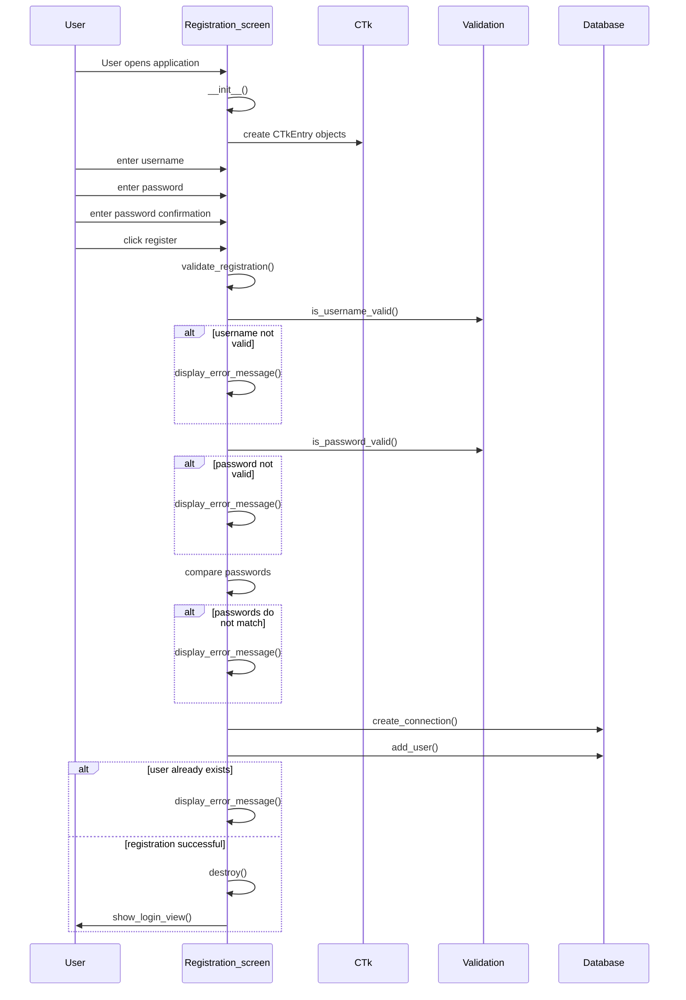

# Arkkitehtuurikuvaus

## Rakenne

## Uuden käyttäjän rekisteröinti

```mermaid
sequenceDiagram
    User->>Registration_screen: User opens application
    Registration_screen->>Registration_screen: __init__()
    Registration_screen->>CTk: create CTkEntry objects
    User->>Registration_screen: enter username
    User->>Registration_screen: enter password
    User->>Registration_screen: enter password confirmation
    User->>Registration_screen: click register
    Registration_screen->>Registration_screen: validate_registration()
    Registration_screen->>Validation: is_username_valid()
    alt username not valid
        Registration_screen->>Registration_screen: display_error_message()
    end
    Registration_screen->>Validation: is_password_valid()
    alt password not valid
        Registration_screen->>Registration_screen: display_error_message()
    end
    Registration_screen->>Registration_screen: compare passwords
    alt passwords do not match
        Registration_screen->>Registration_screen: display_error_message()
    end
    Registration_screen->>Database: create_connection()
    Registration_screen->>Database: add_user()
    alt user already exists
        Registration_screen->>Registration_screen: display_error_message()
    else registration successful
        Registration_screen->>Registration_screen: destroy()
        Registration_screen->>User: show_login_view()
    end
```
