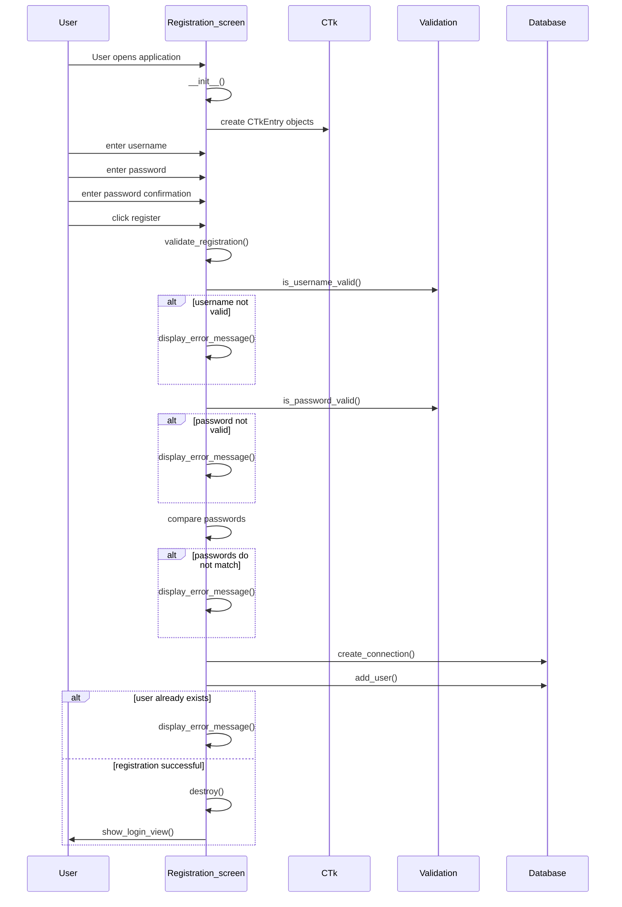
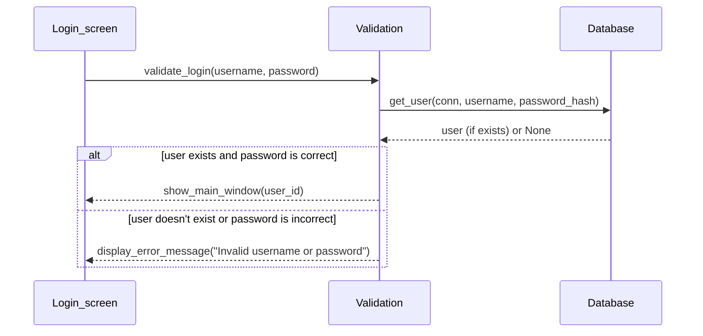
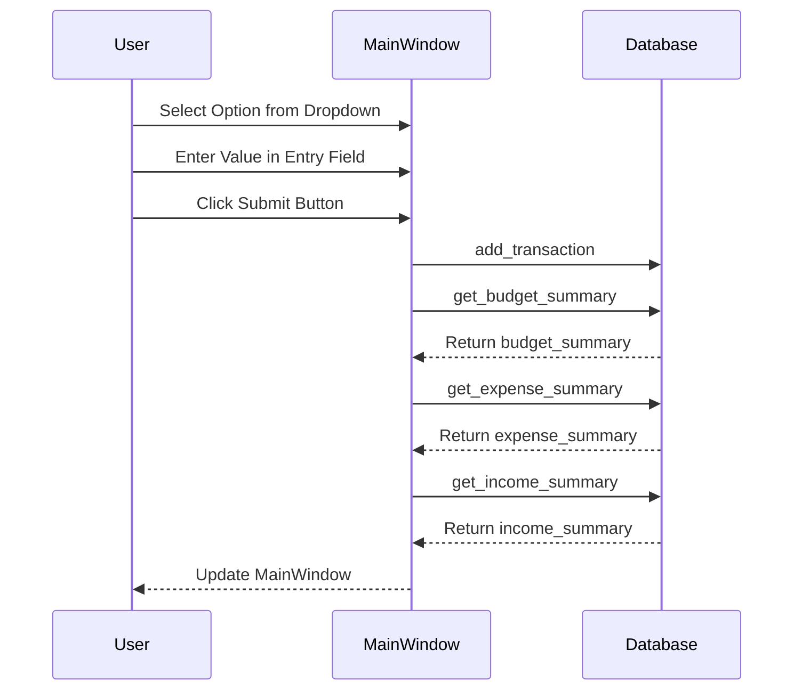
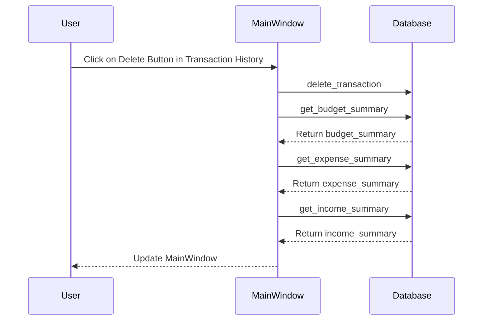

# Arkkitehtuurikuvaus

## Rakenne

Ohjelman rakenne noudattaa kolmitasoista kerrosarkkitehtuuria, ja koodin pakkausrakenne on seuraavanlainen:

Pakkaus _ui_ sisältää käyttöliittymästä, _database_ tietojen pysyväistallennuksesta ja _services_ tietojen tarkistuksesta vastaavan koodin.

## Käyttöliittymä

Käyttöliittymä sisältää kolme erillistä näkymää:

- Rekisteröitymisnäkymä
- Kirjautumisnäkymä
- Päänäkymä ts. tietojen syöttö- ja tarkastelunäkymä

Jokainen käyttöliittymän näkymä on toteutettu omana luokkanaan. Vain yksi luokka on kerrallaan näkyvänä. Näkymien näyttämisesta vastaa [UI](../src/ui/user_interface.py)-luokka. Käyttöliittymä on pyritty eristämään täysin sovelluslogiikasta ja se kutsuu [database](../src/database/database.py) ja [services](../src/services/)-pakkauksien funktioita.

## Tietojen pysyväistallennus

Pakkauksen _database_ [database.py](../src/database/database.py)-tiedosto huolehtii tietojen tallentamisesta SQLite-tietokantaan.

## Päätoiminnallisuudet

### Uuden käyttäjän rekisteröinti

### Käyttäjän kirjautuminen

### Tietojen syöttäminen

### Tietojen poistaminen

