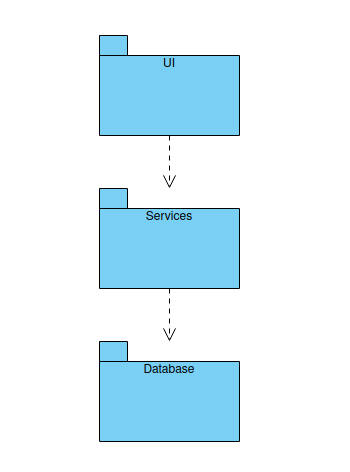

# Arkkitehtuurikuvaus

## Rakenne

Ohjelman rakenne noudattaa kolmitasoista kerrosarkkitehtuuria, ja koodin pakkausrakenne on seuraavanlainen:

Pakkaus _ui_ sisältää käyttöliittymästä, _database_ tietojen pysyväistallennuksesta ja _services_ tietojen tarkistuksesta vastaavan koodin.

## Käyttöliittymä

Käyttöliittymä sisältää kolme erillistä näkymää:

- Rekisteröitymisnäkymä
- Kirjautumisnäkymä
- Päänäkymä ts. tietojen syöttö- ja tarkastelunäkymä

Jokainen käyttöliittymän näkymä on toteutettu omana luokkanaan. Vain yksi luokka on kerrallaan näkyvänä. Näkymien näyttämisesta vastaa [UI](../src/ui/user_interface.py)-luokka. Käyttöliittymä on pyritty eristämään täysin sovelluslogiikasta ja se kutsuu [database](../src/database/database.py) ja [services](../src/services/)-pakkauksien funktioita.

## Tietojen pysyväistallennus

Pakkauksen _database_ [database.py](../src/database/database.py)-tiedosto huolehtii tietojen tallentamisesta SQLite-tietokantaan.

## Päätoiminnallisuudet

### Uuden käyttäjän rekisteröinti

Kun rekisteröitymisnäkymän syötekenttiin syötetään käyttäjätunnus, salasana ja salasana uudelleen varmennuskenttään, jonka jälkeen klikataan painiketta "Register", etenee sovelluksen kontrolli seuraavasti:

[Tapahtumakäsittelijä](https://github.com/trickwide/ot-harjoitustyo/blob/main/src/ui/registration_screen.py#L16) painikkeen painamiseen ja kutsuu `UserService` -luokan metodia [register_here](https://github.com/trickwide/ot-harjoitustyo/blob/main/src/services/user_services.py#L43), jotta tarkistetaan täyttävätkö täytetyt tiedot vaatimukset. Mikäli vaatimukset täyttyvät siirrytään kirjautumisnäkymään. Muussa tapauksessa tapahtumakäsittelijä kutsuu metodia [display_error_message](https://github.com/trickwide/ot-harjoitustyo/blob/main/src/ui/registration_screen.py#L36), joka näyttää virheilmoituksen käyttäjälle.

### Käyttäjän kirjautuminen

Kun kirjautumisnäkymän syötekenttiin syötetään käyttäjätunnus ja salasana, jonka jälkeen klikataan painiketta "Login", etenee sovelluksen kontrolli seuraavasti:

[Tapahtumakäsittelijä](https://github.com/trickwide/ot-harjoitustyo/blob/main/src/ui/login_screen.py#L17) reagoi painikkeen painamiseen ja kutsuu [UserService] -luokan metodia [validate_login](https://github.com/trickwide/ot-harjoitustyo/blob/main/src/services/user_services.py#L76) ja tarkistaa tietokantafunktiolla [get_user](https://github.com/trickwide/ot-harjoitustyo/blob/main/src/database/database.py#L105) onko käyttäjätunnusta olemassa. Jos on, tarkastetaan täsmääkö salasanat. Jos salasanat täsmäävät, kirjautuminen onnistuu. Seurauksena käyttöliittymä vaihtaa näkymäksi `MainWindow` -näkymän eli sovelluksen päänäkymän, jolla näkyvät käyttäjän syöttämät tiedot. Jos käyttäjätunnus tai salasana on virheellinen, kutsuu tapahtumankäsittelijä [display_error_message](https://github.com/trickwide/ot-harjoitustyo/blob/main/src/ui/login_screen.py#L35) -funktiota ja näyttää virheilmoituksen käyttäjäle.

### Tietojen syöttäminen

Kun päänäkymässä valitaan pudotusvalikosta vaihtoehto, syötetään syötekenttään luku ja painetaan "Submit" -painiketta, etenee sovelluksen kontrolli seuraavasti:

[Tapahtumakäsittelijä](https://github.com/trickwide/ot-harjoitustyo/blob/main/src/ui/main_window.py#L18) kutsuu tietokantafunktiota [add_transaction](https://github.com/trickwide/ot-harjoitustyo/blob/main/src/database/database.py#L125),jonka jälkeen kutsutaan [get_budget_summary](https://github.com/trickwide/ot-harjoitustyo/blob/main/src/database/database.py#L163), [get_expense_summary](https://github.com/trickwide/ot-harjoitustyo/blob/main/src/database/database.py#L182) ja [get_income_summary](https://github.com/trickwide/ot-harjoitustyo/blob/main/src/database/database.py#L201) -funktioita, jotta näkymän tietokentät päivittyvät funktioiden palauttamilla arvoilla.

### Tietojen poistaminen

Kun päänäkymän historiatiedoissa painetaan "Delete" -painiketta, etenee sovelluksen kontrolli seuraavasti:

[Tapahtumakäsittelijä](https://github.com/trickwide/ot-harjoitustyo/blob/main/src/ui/main_window.py#L18) kutsuu tietokantafunktiota [delete_transaction](https://github.com/trickwide/ot-harjoitustyo/blob/main/src/database/database.py#L220), jonka jälkeen kutsutaan [get_budget_summary](https://github.com/trickwide/ot-harjoitustyo/blob/main/src/database/database.py#L163), [get_expense_summary](https://github.com/trickwide/ot-harjoitustyo/blob/main/src/database/database.py#L182) ja [get_income_summary](https://github.com/trickwide/ot-harjoitustyo/blob/main/src/database/database.py#L201) -funktioita, jotta näkymän tietokentät päivittyvät funktioiden palauttamilla arvoilla.
