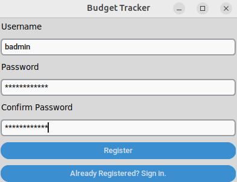
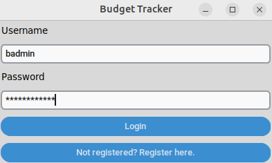
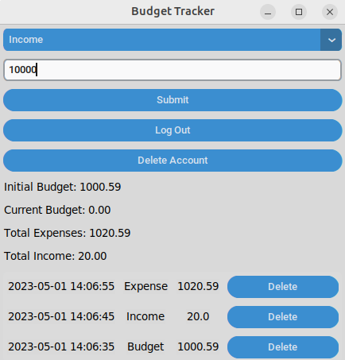

# Käyttöohje

Lataa projektin viimeisimmän [releasen](https://github.com/trickwide/ot-harjoitustyo/releases) lähdekoodi valitsemalla _Assets_-osion alta _Source code_.

## Ohjelman käynnistäminen

Asenna tarvittavat riippuvuudet ennen ohjelman käynnistämistä alla olevalla komennolla:

```bash
poetry install
```

Tämän jälkeen ohjelman käynnistäminen onnistuu komennolla:

```
poetry run invoke start
```

## Rekisteröityminen

Sovellus käynnistyy rekisteröitymisnäkymään:



Käyttäjätunnuksen täytyy olla vähintään 5 merkkiä pitkä ja uniikki.

Salasanan täytyy olla vähintään 12 merkkiä pitkä sekä sisältää vähintään yhden ison kirjaimen, yhden numeron ja yhden erikoismerkin.

Tietojen syöttämisen jälkeen käyttäjätunnus luodaan painamalla "Register"-painiketta.

Jos käyttäjän luominen onnistuu, siirrytään kirjautumisnäkymään.

Mikäli käyttäjä on jo rekisteröitynyt palveluun, siirtyminen kirjautumisnäkymään onnistuu painamalla "Already registered? Sign in."-painiketta.

## Kirjautuminen



Käyttäjä voi kirjautua palveluun syöttämällä olemassaolevan käyttäjätunnuksen tiedot syötekenttiin ja painamalla "Login"-painiketta.

Mikäli kirjautuminen onnistuu, siirrytään sovelluksen päänäkymään, jossa käyttäjä pääsee syöttämään budjettitietojaan ja tarkastelemaan syöttämiään tietoja.

Rekisteröitymisnäkymään pääsee kirjautumisnäkymästä painamalla "Not registered? Register here."-painiketta.

## Budjettitietojen syöttäminen ja poistaminen



Päänäkymän pudotusvalikosta käyttäjä voi valita mitä tietoja hän haluaa syöttää. Vaihtoehtoina on budjetti "Budget", tulo "Income" ja meno "Expense".

Syötekenttä ottaa vastaan numerot muodossa 10 tai 10.0, ja tiedon kirjaaminen onnistuu painamalla "Submit"-painiketta.

Käyttäjä pääsee kirjautumaan ulos painamalla "Log out"-painiketta, jolloin käyttäjä ohjataan takaisin kirjautumisnäytölle.

Käyttäjätunnuksen poistaminen onnistuu painamalla "Delete account"-painiketta, jonka jälkeen käyttäjätunnus sekä sen budjettitiedot poistetaan palvelusta.

Päänäkymä listaa alkuperäisen budjetin "Initial Budget", jäljellä olevan budjetin "Current Budget", menot yhteensä "Total Expenses" ja tulot yhteensä "Total Income".

Lisäksi päänäkymä näyttää kymmenen viimeisimmän syötetyn tiedon päivämäärän sekä kellonajan, syötteen tyypin ja syötteen arvon.

Käyttäjä voi poistaa yksittäisiä syötteitä painamalla "Delete"-painiketta, joka on syötteen oikealla puolella.
