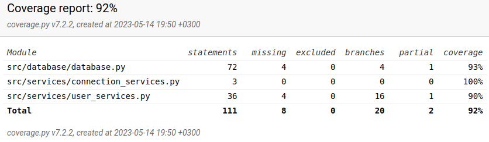

# Testausdokumentti

Ohjelmaa on testattu sekä automatisoiduin yksikkö- ja integraatiotestein unittestilla sekä manuaalisesti tapahtunein järjestelmätason testein.

## Yksikkö- ja integraatiotestaus

### Testiluokat

`UserService` -luokkaa, joka vastaa rekisteröitymis- ja kirjautumistietojen oikeellisuudesta, testataan [TestUserService](https://github.com/trickwide/ot-harjoitustyo/blob/main/src/tests/test_user_service.py) -testiluokalla.

`database.py` -tiedoston funktioiden testaus suoritetaan [TestDatabase](https://github.com/trickwide/ot-harjoitustyo/blob/main/src/tests/test_database.py) -testiluokalla.

### Testikattavuus

Sovelluksen haaraumakattavuus on 92%. Tähän ei ole laskettu mukaan käyttöliittymäkerrosta, jota ei testata.

[TestUserService](https://github.com/trickwide/ot-harjoitustyo/blob/main/src/tests/test_user_service.py) -testiluokasta puuttuu mm. [UserService](https://github.com/trickwide/ot-harjoitustyo/blob/main/src/services/user_services.py) -luokan `validate_user_credentials` -funktion testaaminen täysin. Tämän dokumentin lopussa laatuongelmista lisää, johon tämä testauspuute myös liittyy.

## Järjestelmätestaus

### Asennus ja käyttö

Sovellus on ladattu ja sitä on testattu [käyttöohjeen](./kayttoohje.md) kuvaamalla tavalla sekä Linux- että Windows -ympäristössä.

Sovelluksen testaus on suoritettu tilanteissa, joissa käyttäjät sekä syötetyt tiedot ovat olleet olemassa ja joissa niitä ei ole entuudestaan ollut olemassa.

### Toiminnallisuudet

[Vaatimusmäärittelydokumentissa](./vaatimusmaarittely.md) listatut ominaisuudet on käyty läpi. Syötekenttiin on yritetty syöttää virheellistä tietoa kuten liian lyhyttä salasanaa tai tyhjää arvoa.

## Sovellukseen jääneet laatuongelmat

Sovelluksen toiminnallisuudessa itsessään ei ole ilmeisiä laatuongelmia, jotka vaikuttaisivat sovelluksen toimintaan. Kuitenkin automaattitestien suhteen on seuraavia ongelmia:

- `TestDatabase` -luokka hyödyntää testeissä SQLiteä sisäisessä muistissa, mutta `TestUserService` taas luo itselleen ylimääräisen `budget_tracker.db` -tiedoston testeilleen. Tämä johtuu `UserService` -luokan tavasta hyödyntää tietokantayhteyttä ja tämä tulisi myöhemmässä kehityksessä muuttaa.
- Ylläolevasta johtuu, että `poetry run invoke test` ajaa automaattitestit mallikkaasti ensimmäisellä yrityksellä, mutta jos komentoa yrittää uudelleen, epäonnistuu osa testeistä koska testin käyttämä budget_tracker.db on jo populoitu tiedolla.
